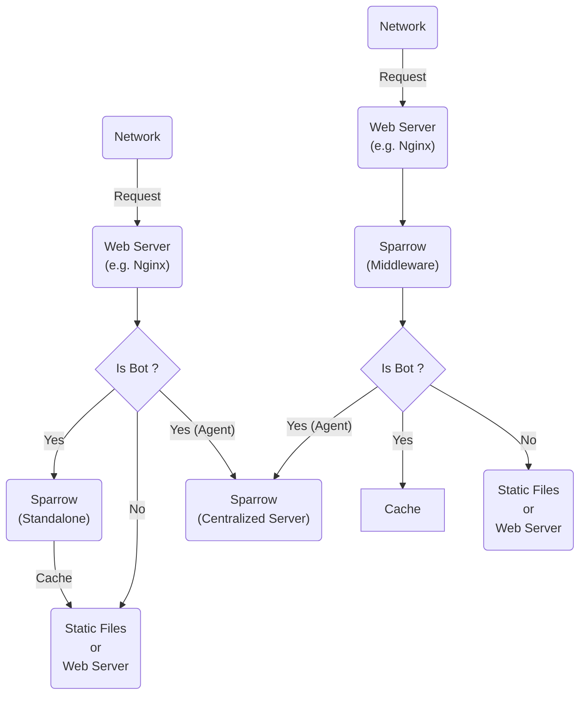

# Sparrow 🐦

[](LICENSE)

> A high-performance SEO prerendering middleware designed to enhance search engine optimization for Single Page Applications (SPAs)

## 📋 Overview

Sparrow is a powerful prerendering solution that bridges the gap between modern Single Page Applications and search engine crawlers.

By serving pre-rendered HTML snapshots to search engine bots while maintaining the dynamic, client-side experience for regular users, Sparrow ensures your SPA content is fully indexable and SEO-friendly.

### The Problem

Modern SPAs built with frameworks like React, Vue, Angular, or Svelte deliver exceptional user experiences but face significant SEO challenges:

- **Search engine crawlers** often struggle to execute JavaScript
- **Initial page loads** show minimal HTML, making content invisible to bots
- **Dynamic content** isn't properly indexed, leading to poor search rankings
- **Social media previews** fail to display proper meta tags and images

### The Solution

Sparrow intercepts requests from search engine bots and social media crawlers, renders the JavaScript-heavy pages in a headless browser, and serves fully-rendered HTML. This ensures:

- ✅ Complete content indexing by search engines
- ✅ Proper meta tags for social media sharing
- ✅ Improved search rankings and visibility
- ✅ Fast response times with intelligent caching
- ✅ No changes required to your existing SPA code

Logical flow of Sparrow:

```
  ┌─────────────┐
  │   Request   │
  └──────┬──────┘
         │
         │
┌─────────────────┐ Yes  ┌──────────────┐
│ Is Bot/Crawler? ├──────│    Sparrow   │
└────────┬────────┘      │  Prerenderer │
         │               └──────┬───────┘
         │ No                   │
         │                      │
         │               ┌──────────────┐
         │               │ Render with  │
         │               │ Headless     │
         │               │ Browser      │
         │               └──────┬───────┘
         │                      │
         │                      │
         │               ┌──────────────┐
         │               │ Return Full  │
         │               │ HTML content │
         │               └──────┬───────┘
         │                      │
         │                      │
┌─────────────────┐             │
│  Serve Original │─────────────┘
│   SPA Content   │
└─────────────────┘
```

## 🚀 Key Features

- **🔍 Smart Bot Detection**: Automatically identifies search engine crawlers and social media bots
- **⚡ High Performance**: Optimized rendering pipeline with intelligent caching strategies
- **🎯 Selective Rendering**: Only prerenders when necessary, serving regular users directly
- **🔄 Cache Management**: Configurable cache invalidation and refresh policies
- **📊 Analytics Ready**: Built-in logging and monitoring capabilities
- **🛠️ Easy Integration**: Simple setup with minimal configuration required
- **🔒 Security First**: Protection against common vulnerabilities and abuse
- **📱 Mobile-Friendly**: Supports mobile user agents and responsive content

## 🏗️ How It Works

The left side is the standalone mode, and the right side is the middleware mode.
In middleware mode, bot requests are directly proxied to Sparrow, while in standalone mode, bot requests are identified by your web server (e.g. Nginx) and then proxied to Sparrow.
**Tips**: In middleware mode, Sparrow will performed as a reverse proxy for non-bot requests, so you don't need to configure your web server to identify bots, which is more convenient and easier to maintain.



## 🔧 Development

### Prerequisites

- Node.js (v14 or higher)
- npm or yarn
- Your SPA application deployed and accessible

### Quick Start

```bash
# Clone the repository
git clone https://github.com/NimbusAsm/Sparrow.git

# Navigate to the directory
cd Sparrow

# Install dependencies
npm install

# Configure your settings
cp config.example.json config.json

# Start the server
npm start
```

## ⚙️ Configuration

Create a `config.json` file in the root directory:

```json
{
  "port": 7700,
  "mode": "standalone", // or "middleware"
  "cache": {
    "enabled": true, // Enable caching of prerendered pages
    "ttl": 3600, // Cache time-to-live in seconds
    "maxSize": "100MB" // Maximum cache size (e.g., "100MB", "1GB")
  },
  // In "agent" mode, Sparrow will pass bots requests to a centralized Sparrow Server which do the actual prerendering works.
  "agent": {
    "enabled": false,
    "centralized": {
      "link": "http://localhost:7701" // Centralized Sparrow Server URL
    }
  },
  // In "standalone" mode, Sparrow will do the prerendering works by itself, and you need to configure your web server (e.g. Nginx or Caddy) to identify bots and proxy bot requests to Sparrow.
  "standalone": {
    "targetUrl": "https://your-spa-website.com", // Your SPA URL to prerender
    "rendering": {
      "timeout": 30000, // Page render timeout in milliseconds
      "waitUntil": {
        "signal": "networkidle0", // Wait condition for rendering (e.g., "networkidle0", "load", "domcontentloaded")
        "continousTimeout": 1000 // Additional timeout to wait for continuous network activity after signal
      }
    }
  },
  // In "middleware" mode, Sparrow will do the prerendering works by itself, and you don't need to configure your web server (e.g. Nginx or Caddy) to identify bots, which is more convenient and easier to maintain.
  "middleware": {
    "proxy": {
      "host": "localhost",
      "port": 5000, // Your SPA server port
      "protocol": "http" // or "https"
    },
    // In "middleware" mode, bots identification is operated by Sparrow rather than your web server (e.g. Nginx or Caddy)
    "bots": {
      "userAgents": [
        "googlebot",
        "bingbot",
        "slackbot",
        "twitterbot",
        "facebookexternalhit",
        {
          "name": "baidu",
          "pattern": "baiduspider",
          "UA": "Mozilla/5.0 (compatible; Baiduspider/2.0; +http://www.baidu.com/search/spider.html)"
        }
      ]
    }
  }
}
```

## 🔧 Usage

### As a Standalone Server

Then configure your web server (Nginx, Apache, etc.) to proxy bot requests to Sparrow.

### Nginx Configuration Example

```nginx
location / {
    if ($http_user_agent ~* "googlebot|bingbot|slackbot|twitterbot|facebookexternalhit") {
        proxy_pass http://localhost:3000;
    }
    # Regular traffic goes to your SPA
    try_files $uri $uri/ /index.html;
}
```

### Docker Deployment

Docker Compose Example:

```yaml
services:
  sparrow:
    image: nimbusasm/sparrow
    ports:
      - "7700:7700"
      - "7701:7701" # Monitoring port
    volumes:
      - ./config.json:/app/config.json # In this file, config your spa page url (We suggest you to use Caddy for your SPA website)
    networks:
      - sparrow_network

  website:
    image: your-spa-image
    networks:
      - sparrow_network
    depends_on:
      - sparrow

networks:
  sparrow_network:
    driver: bridge
```

## 📊 Monitoring

Sparrow provides built-in monitoring endpoints:

- `GET /health` - Health check endpoint
- `GET /metrics` - Performance and cache metrics
- `GET /cache/stats` - Cache statistics

## 🔍 Supported Bots

Sparrow automatically detects and prerenders for:

- **Search Engines**: Google, Bing, Yahoo, DuckDuckGo, Baidu, Yandex
- **Social Medias**: Facebook, Twitter, LinkedIn, Slack, Discord
- **Messaging Apps**: WhatsApp, Telegram
- **Others**: Pinterest, Reddit, and more

## 🛡️ Security

Sparrow includes several security features:

- Rate limiting to prevent abuse
- Request validation and sanitization
- Configurable allowed domains
- Protection against SSRF attacks
- Secure header handling

## 🤝 Contributing

We welcome contributions! Please follow these steps:

1. Fork the repository
2. Create a feature branch (`git checkout -b feature/amazing-feature`)
3. Commit your changes (`git commit -m 'Add amazing feature'`)
4. Push to the branch (`git push origin feature/amazing-feature`)
5. Open a Pull Request

Please ensure your code follows our coding standards and includes appropriate tests.

## 📝 License

This project is licensed under the MIT License - see the [LICENSE](LICENSE) file for details.

## 🙏 Acknowledgments

- Built with modern Node.js and Puppeteer/Playwright
- Inspired by the need for better SPA SEO solutions
- Community-driven development and feedback

## 📞 Support

- 🐛 **Issues**: [GitHub Issues](https://github.com/NimbusAsm/Sparrow/issues)
- 💬 **Discussions**: [GitHub Discussions](https://github.com/NimbusAsm/Sparrow/discussions)
- 📧 **Email**: support@catrol.email

# Contributors

[](https://github.com/NimbusAsm/Sparrow/graphs/contributors)

# Star History

<!-- [](https://star-history.com/#Crequency/KitX&Timeline) -->

[](https://starchart.cc/NimbusAsm/Sparrow)

# Thanks to

<p align="center">
  <a href="https://www.crequency.com" target="_blank" rel="noopener noreferer">
    
  </a>
</p>

<h2 align="center"><b>Crequency</b><br>Developer Community</h2>

<p align="center">
    Thanks to the great ideas from <a href="https://www.crequency.com" target="_blank">Crequency Developer Community</a>, we can make the world better.
</p>

<br>
<br>

<p align="center">
  <a href="https://www.jetbrains.com/" target="_blank" rel="noopener noreferrer">
    
  </a>
</p>

<h2 align="center"><b>JetBrains</b><br>Great Softwares for Developers</h2>

<p align="center">
    Thanks to the great tools from <a href="https://www.jetbrains.com/" target="_blank">JetBrains</a>, we can turn our ideas into reality.
</p>
